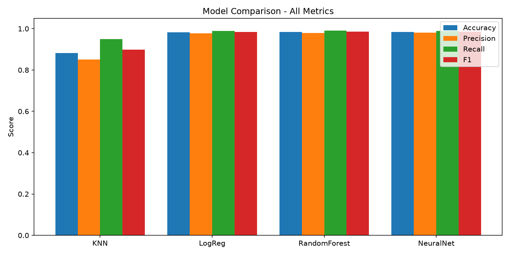

# Fake News Detection — End-to-End ML Pipeline

A complete machine learning pipeline that classifies news articles as **real** or **fake** using text classification. Built from scratch with manual tokenization and custom preprocessing — no high-level NLP wrappers.



---

## What this project does

Takes raw news articles, cleans them up (strips URLs, punctuation, stopwords, and source-tag leakage like Reuters datelines), converts the text into TF-IDF vectors, and runs four different classifiers on them:

- **K-Nearest Neighbors (KNN)** — tuned with cosine distance + GridSearchCV
- **Logistic Regression** — L2-regularized, hyperparameter-tuned
- **Random Forest** — 100-tree ensemble
- **MLP Neural Network** — single hidden layer, Adam optimizer

The pipeline also includes statistical significance testing (McNemar's test, bootstrap confidence intervals) and a small out-of-domain generalization check on 2023+ news articles.

## Results at a glance

| Model | Accuracy | Precision | Recall | F1 Score | Inference Time |
|-------|----------|-----------|--------|----------|----------------|
| KNN (Cosine, K=31) | 88.29% | 85.15% | 94.95% | 89.78% | 6.55s |
| Logistic Regression | 98.24% | 97.83% | 98.94% | 98.38% | 2.5ms |
| Random Forest | 98.36% | 97.95% | 99.06% | 98.50% | 0.16s |
| MLP Neural Net | 98.41% | 98.17% | 98.91% | 98.54% | 25.3ms |
| KNN + LSA (200-d) | 91.06% | 90.01% | 93.94% | 91.93% | 0.52ms |

> **Note:** All numbers are post-leakage-correction. We stripped Reuters dateline templates from real news articles to prevent the models from cheating on source identification rather than actually learning content patterns.

## Project layout

```
fake-news-detection/
├── src/                          # Core pipeline modules
│   ├── preprocessing.py          # Text cleaning, tokenization, dateline stripping
│   ├── features.py               # BoW & TF-IDF vectorization, top feature extraction
│   ├── models.py                 # Model training, hyperparameter tuning (GridSearchCV)
│   ├── evaluate.py               # Metrics, confusion matrices, McNemar, bootstrap CI
│   └── utils.py                  # Shared helpers
├── notebooks/                    # Weekly Jupyter notebooks (EDA → Evaluation)
│   ├── week1_data_eda.ipynb
│   ├── week2_feature_engineering.ipynb
│   ├── week3_model_building.ipynb
│   └── week4_evaluation.ipynb
├── run_phase1.py                 # Phase 1: Data loading & preprocessing
├── run_phase2.py                 # Phase 2: Feature extraction (BoW + TF-IDF)
├── run_phase3.py                 # Phase 3: Model training
├── run_phase4.py                 # Phase 4: Evaluation & reporting
├── docs/                         # IEEE-format LaTeX report + compiled PDF
│   └── final_report_IEEE.tex
├── presentation/                 # PowerPoint slides
│   └── final_slides.pptx
├── results/
│   ├── figures/                  # Confusion matrices, bar charts, EDA plots
│   └── metrics/                  # JSON metrics dump
├── tests/                        # Unit tests
├── data/                         # Dataset directory (see data/README.md)
└── requirements.txt
```

## Getting started

### 1. Clone and set up

```bash
git clone https://github.com/<your-username>/fake-news-detection.git
cd fake-news-detection

python -m venv venv
source venv/bin/activate        # Windows: venv\Scripts\activate
pip install -r requirements.txt
```

### 2. Download the dataset

Grab the ISOT Fake and Real News Dataset from [Kaggle](https://www.kaggle.com/datasets/clmentbisaillon/fake-and-real-news-dataset) and drop `Fake.csv` and `True.csv` into `data/raw/`. See [`data/README.md`](data/README.md) for full details.

### 3. Run the pipeline

```bash
python run_phase1.py    # Clean text, remove duplicates, strip datelines
python run_phase2.py    # Build TF-IDF and BoW feature matrices
python run_phase3.py    # Train all four models
python run_phase4.py    # Evaluate, generate plots and metrics
```

Or open the notebooks in `notebooks/` if you prefer stepping through things interactively.

## Key design decisions

**Why manual tokenization?**  
I wanted to understand what happens under the hood instead of just calling `spaCy` or `transformers`. The tokenizer in `src/preprocessing.py` handles lowercasing, URL removal, punctuation stripping, and stopword filtering — nothing fancy, but it's transparent and easy to debug.

**Why strip Reuters datelines?**  
The original dataset has a nasty leakage issue: all real news articles start with patterns like `WASHINGTON (Reuters) -` while fake articles don't. Without cleaning this, models can hit 99%+ accuracy by just spotting the word "reuters" — which obviously won't generalize to anything useful. After stripping these templates with a regex, accuracy drops by 1-2% across the board, but the models are actually learning content patterns now.

**Why cosine distance for KNN?**  
TF-IDF vectors are high-dimensional (5000 features) and sparse. Euclidean distance gets dominated by document length differences in that kind of space. Cosine distance only looks at the angle between vectors, which is what TF-IDF was designed for. Interestingly, since scikit-learn's `TfidfVectorizer` L2-normalizes by default, cosine and Euclidean produce mathematically identical rankings — but Manhattan distance falls apart completely (44% accuracy vs 88%).

## What I learned

- TF-IDF is still surprisingly competitive for binary text classification when the preprocessing is done right. The gap between a tuned Logistic Regression and a neural net was less than 0.2%.
- Data leakage is sneaky. The Reuters dateline issue inflated all models by 1-2% and would've gone unnoticed without actually looking at the top TF-IDF features.
- KNN struggles with high-dimensional sparse data. Dropping from 5000 to 200 features via LSA (Truncated SVD) pushed KNN accuracy from 88% to 91%, which tells you a lot about the curse of dimensionality.
- Statistical tests matter. McNemar's test showed the difference between Random Forest and Logistic Regression (98.36% vs 98.24%) isn't statistically significant (p = 0.44). Headlines and leaderboards don't tell you that.

## Dataset

**ISOT Fake and Real News Dataset** — 39,098 articles after cleaning (17,902 fake, 21,196 real). Originally sourced from Reuters (real) and various flagged websites (fake), covering US political news from 2016-2017.

See [`data/README.md`](data/README.md) for download instructions.

## Report & Presentation

- Full IEEE-format paper: [`docs/final_report_IEEE.pdf`](docs/final_report_IEEE.pdf)
- Slide deck: [`presentation/final_slides.pptx`](presentation/final_slides.pptx)

## License

MIT — see [LICENSE](LICENSE).
